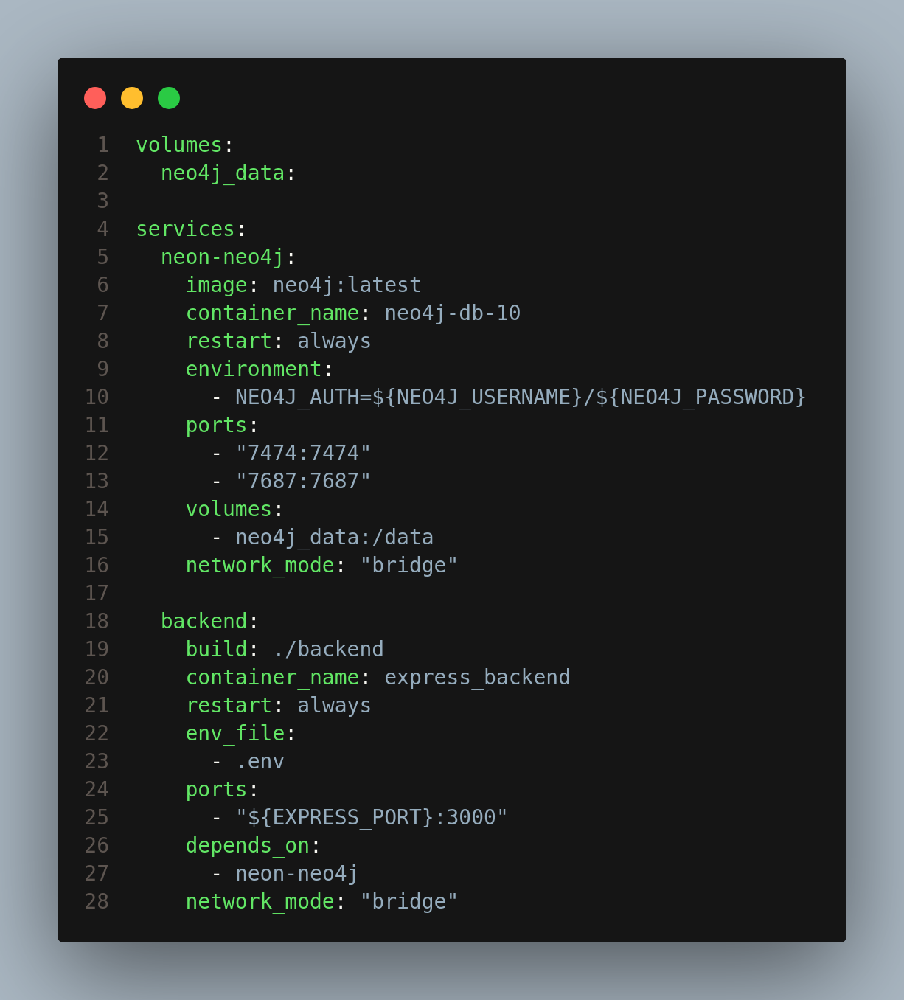
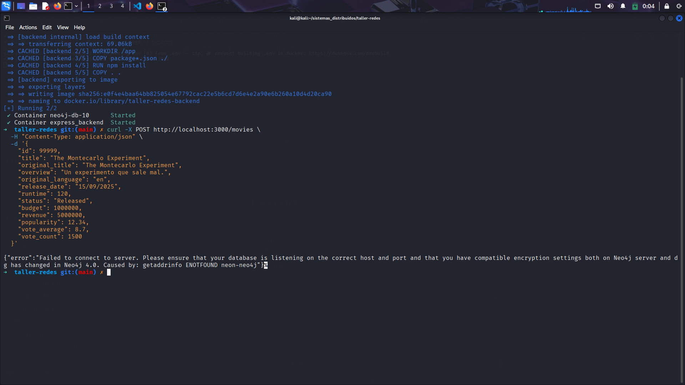

# TALLER DOCKER COMPOSE

Tenemos el docker compose donde declaramos los dos servicios, y modificamos el archivo [docker-compose.yml](docker-compose.yml) conectandolos por defecto a la red bridge sin declarar redes



Subimos nuestros servicios nuevamente con el nuevo archivo docker-compose e intentaremos conectarnos a la base de datos con nuestra API, para esto utilizaremos el metodo post que creamos para agregar un registro a la tabla Movie de la siguiente manera

```bash
curl -X POST http://localhost:3000/movies \
  -H "Content-Type: application/json" \
  -d '{
    "id": 9999,
    "title": "The Montecarlo Experiment",
    "original_title": "The Montecarlo Experiment",
    "overview": "Un experimento que sale mal.",
    "original_language": "en",
    "release_date": "15/09/2025",
    "runtime": 120,
    "status": "Released",
    "budget": 1000000,
    "revenue": 5000000,
    "popularity": 12.34,
    "vote_average": 8.7,
    "vote_count": 1500
  }'
```

Esta es la salida de nuestra peticion POST



Estos son los logs que muestra nuestra API


Verificamos la existencia de nuestra nueva pelicula en la base de datos mediante la siguiente consulta:

```bash
MATCH (m:Movie {id: 9999})
RETURN m;
```


Ahi aparece definida en la segunda posicion, al parecer le atine sin querer a un id que ya existia

Ahora, Subiremos nuestros servicios nuevamente con una modificacion a nuestro archivo docker-compose e intentaremos conectarnos a la base de datos con nuestra API pero esta vez declararemos una red llamada **user-defined**, configuraremos ambos servicios en esta red. asi quedaria el archivo [docker-compose.yml](docker-compose.yml)


y utilizaremos nuevamente el metodo post que creamos para agregar un registro a la tabla Movie de la siguiente manera:

```bash
curl -X POST http://localhost:3000/movies \
  -H "Content-Type: application/json" \
  -d '{
    "id": 99998,
    "title": "Perfect Blue",
    "original_title": "Perfect Blue",
    "overview": " follows Mima, a pop star who quits singing to become an actress but is stalked by a fan and haunted by her past as a pop idol.",
    "original_language": "jap",
    "release_date": "05/03/1997",
    "runtime": 90,
    "status": "Released",
    "budget": 1000000,
    "revenue": 5000000,
    "popularity": 12.34,
    "vote_average": 8.7,
    "vote_count": 1500
  }'
```

Esta es la salida de nuestra peticion POST


Estos son los logs que muestra nuestra API


Verificamos la existencia de nuestra nueva pelicula en la base de datos mediante la siguiente consulta:

```bash
MATCH (m:Movie {id: 99998})
RETURN m;
```


## Conclusion

Definir una red resulta más práctica y recomendable para proyectos distribuidos que la red bridge por defecto.

Para empezar, con esto podemos asegurar que cada proyecto puede tener su propia red aislada, Automatizando este proceso y evitando conflictos de conexiones indeseadas entre contenedores de distintos proyectos. De igual manera, Docker se asegura de asignar automáticamente un DNS interno donde los contenedores se comunican usando esta configuracion automaticamente, lo que simplifica en caso de tener muchos contenedores y hace que el código sea más portable, usar redes definidas por el usuario permite añadir más servicios sin riesgo de colisiones con otros proyectos.

## Referencias

Docker. _Bridge network driver – Differences between user-defined bridges and the default bridge_.  
 En Docker Documentation. Disponible en: [https://docs.docker.com/network/drivers/bridge/](https://docs.docker.com/network/drivers/bridge/)
